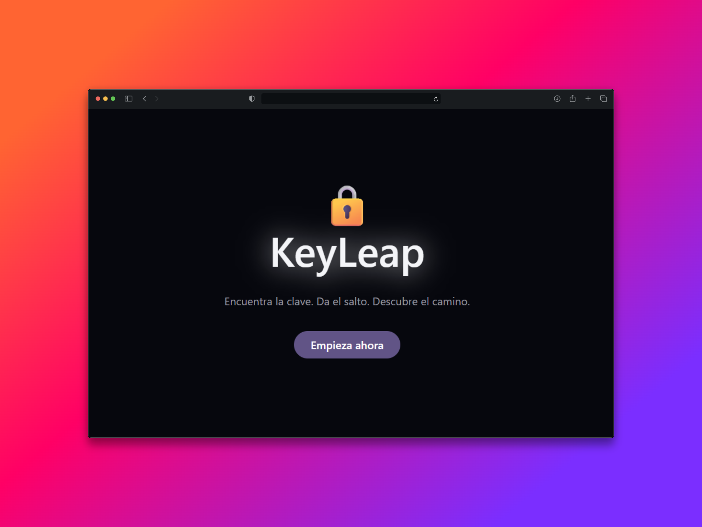

# KeyLeap 🔐

Un emocionante juego interactivo de caza del tesoro y escalada de privilegios. ¡Pon a prueba tu ingenio para descubrir secretos y alcanzar el máximo nivel de acceso!

## 📝 Descripción del Proyecto

KeyLeap es un juego de tipo "captura la bandera" (CTF) o "caza del tesoro" donde tu objetivo principal es obtener las credenciales (nombre de usuario y contraseña) de usuarios con permisos cada vez mayores. Comenzarás con una cuenta básica sin privilegios especiales, y a medida que superes diferentes retos y resuelvas puzzles, irás descubriendo la información necesaria para iniciar sesión como usuarios con más poder.

El juego está diseñado para desafiar tu capacidad de observación, resolución de problemas y pensamiento lateral. Cada nivel de acceso desbloquea nuevos puzzles y áreas del juego, llevándote más cerca del codiciado acceso `root`.

Los niveles de privilegio en KeyLeap, representados por usuarios reales dentro del sistema, son:
1.  **member:** El punto de partida. Todos los nuevos jugadores crean su cuenta personalizada y comienzan aquí. Esta cuenta está asociada al rol de organización `member` en Clerk, con acceso limitado a los servicios básicos del juego.
2.  **support:** El primer escalón. Conseguir las credenciales de un usuario `support` y iniciar sesión como tal te permitirá acceder a nueva información o servicios que antes estaban bloqueados. Estos usuarios tienen el rol de organización `support`.
3.  **admin:** Un nivel con privilegios significativos. Iniciar sesión como un usuario `admin` (con rol `admin`) te dará acceso a páginas web dedicadas y funcionalidades restringidas, cruciales para avanzar.
4.  **root:** El nivel más alto. Obtener e iniciar sesión con las credenciales de un usuario `root` (con rol `root`) significa que has completado el juego, accediendo a su propia página exclusiva.

## 🚀 Demo

¡Prueba el juego aquí!
[Enlace a la Demo KeyLeap](https://keyleap.vercel.app/)

## 📸 Capturas de Pantalla / GIFs

## 🔐 Uso de Clerk para la Autenticación y Autorización

[Clerk](https://clerk.com/) es el núcleo de la gestión de identidades y permisos en KeyLeap, asegurando que cada usuario acceda únicamente al contenido y funcionalidades que le corresponden.

Así es como se utiliza Clerk en el proyecto:

1.  **Autenticación de Usuarios:**
    * Los jugadores crean su propia cuenta personal al inicio utilizando Clerk. Esta cuenta se asigna automáticamente al rol de organización `member`.
    * Los usuarios `support`, `admin`, y `root` son cuentas de usuario reales preexistentes en la base de datos de Clerk, cada una con su respectivo rol de organización (`support`, `admin`, `root`).
    * Para progresar, el jugador debe descubrir las credenciales de estos usuarios y **realizar un inicio de sesión completo** con dichas credenciales. Clerk maneja estas sesiones de forma segura.

2.  **Autorización Basada en Roles de Organización:**
    * **Rol `member`:** Los usuarios con este rol tienen una experiencia inicial. Ciertos servicios o funcionalidades dentro de la aplicación están bloqueados para ellos. Esta restricción se implementa en el frontend, verificando el rol del usuario activo en Clerk y actualizando el estado de la aplicación para restringir o permitir el acceso a componentes o llamadas a API.
    * **Rol `support`:** Al iniciar sesión como un usuario `support`, los servicios que estaban bloqueados para los `member` se habilitan. La aplicación detecta el cambio de rol a `support` y desbloquea estas funcionalidades.
    * **Roles `admin` y `root`:** Estos roles tienen un nivel de acceso superior. Los usuarios que inician sesión con cuentas `admin` o `root` son redirigidos o tienen acceso a páginas web completamente separadas y dedicadas. Clerk protege estas rutas, de modo que solo los usuarios autenticados con el rol correcto (`admin` o `root` respectivamente) pueden visualizarlas. Si un usuario sin el rol adecuado intenta acceder, se le denegará el acceso.

3.  **Escalada de Privilegios Real:**
    * La "escalada de privilegios" en KeyLeap no es simulada; es un cambio real de contexto de usuario. El jugador cierra sesión con su cuenta `member` (o la cuenta de nivel inferior que esté usando) e inicia sesión con las credenciales del usuario de nivel superior que ha descubierto.
    * Clerk gestiona la sesión de cada usuario, asegurando que los permisos y roles se apliquen correctamente según el usuario que haya iniciado sesión.

En resumen, Clerk facilita la creación de cuentas personales, la existencia de cuentas con diferentes niveles de privilegio (`support`, `admin`, `root`) mediante roles de organización, y el proceso de iniciar sesión como estos diferentes usuarios para progresar en el juego, controlando el acceso a distintas funcionalidades y páginas web dedicadas según el rol del usuario autenticado.

---

## 🛠️ Tecnologías Utilizadas

Este proyecto ha sido construido utilizando las siguientes tecnologías principales:

* **[Next.js](https://nextjs.org/):** Un framework de React para construir aplicaciones web renderizadas en el servidor y estáticas.
* **[Tailwind CSS](https://tailwindcss.com/):** Un framework de CSS "utility-first" para diseñar rápidamente interfaces de usuario personalizadas.
* **[Clerk](https://clerk.com/):** Plataforma para la autenticación y gestión de usuarios.
